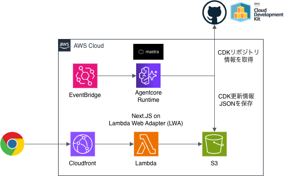
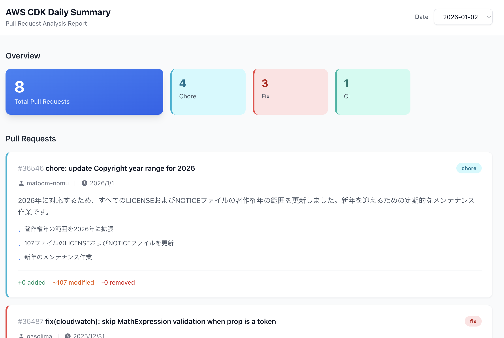

# AWS CDK Daily Summary

AWS CDK リポジトリのPull Requestを毎日分析し、サマリーレポートを自動生成するシステムです

## URL

https://d2t5fomzexey4a.cloudfront.net/

## アーキテクチャ



## フロントエンド



## 機能

- **自動PR分析**: 毎日JST 9:00に過去24時間のPRを分析
- **AIサマリー生成**: Bedrock Agentがカテゴリ分類・要約を自動生成
- **レポート閲覧**: Next.jsベースのWebフロントエンドでレポートを表示
- **日付切り替え**: 過去のレポートを日付で選択して閲覧可能

## プロジェクト構成

```
.
├── cdk/          # AWS CDKインフラストラクチャ
├── mastra/       # Mastra AIエージェント
└── webapp/       # Next.js フロントエンド
```

## 技術スタック

| コンポーネント | 技術 |
|---------------|-----|
| IaC | AWS CDK (TypeScript) |
| AIエージェント | Mastra + Amazon Bedrock |
| フロントエンド | Next.js 15 + React 19 + Tailwind CSS |
| スケジューラ | Amazon EventBridge Scheduler |
| ストレージ | Amazon S3 |
| CDN | Amazon CloudFront |

## セットアップ

### 前提条件

- Node.js 20+
- pnpm 9+
- AWS CLI (認証設定済み)
- AWS CDK CLI

### インストール

```bash
# 依存関係のインストール
cd cdk && pnpm install
cd ../mastra && pnpm install
cd ../webapp && pnpm install
```

### 自動デプロイ設定（GitHub Actions）

このプロジェクトは、mainブランチへのpush時に自動的にAWSへデプロイされます。

#### 必要なGitHub Secrets

リポジトリの Settings > Secrets and variables > Actions で以下のSecretを設定してください：

- `AWS_DEPLOY_ROLE_ARN`: OIDC連携用のIAMロールARN
  - 値: `arn:aws:iam::214794239830:role/GithubActionsDeployRole`

#### ワークフロー

- `.github/workflows/deploy.yml`: mainブランチへのpush時に自動デプロイ
- 手動実行も可能（Actions > Deploy to AWS > Run workflow）

### 手動デプロイ

```bash
cd cdk
pnpm cdk deploy
```

## ローカル開発

### フロントエンド

```bash
cd webapp
pnpm dev
```

### Mastraエージェント

```bash
cd mastra
pnpm dev
```

## 出力

デプロイ後、以下の情報が出力されます:

- `ReportBucketName`: レポート保存用S3バケット名
- `FrontendUrl`: フロントエンドのCloudFront URL

## ライセンス

MIT
